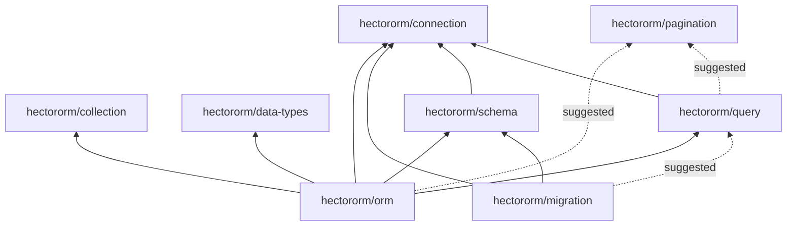

---
breadcrumb:
  - Architecture
summary-order: 2
keywords:
  - architecture
  - packages
  - overview
  - modular
  - dependency
---

# 🏗️ Architecture

**Hector ORM** is designed as a **modular ecosystem** of independent PHP packages. Each package solves a specific
problem and can be used on its own — or combined with others to form a full-featured ORM.

This page gives you a high-level overview of the ecosystem: what each package does, how they relate to each other, and
where to start reading.

---

## Package overview

| Package                                                                       | Namespace           | Description                                           | Standalone |
|-------------------------------------------------------------------------------|---------------------|-------------------------------------------------------|:----------:|
| [`hectororm/orm`](https://packagist.org/packages/hectororm/orm)               | `Hector\Orm`        | Entity mapping, relationships, storage, events        |     —      |
| [`hectororm/collection`](https://packagist.org/packages/hectororm/collection) | `Hector\Collection` | Typed collections and lazy collections                |     ✔      |
| [`hectororm/connection`](https://packagist.org/packages/hectororm/connection) | `Hector\Connection` | PDO wrapper, connection set, drivers, logging         |     ✔      |
| [`hectororm/data-types`](https://packagist.org/packages/hectororm/data-types) | `Hector\DataTypes`  | Type casting between database and PHP                 |     ✔      |
| [`hectororm/query`](https://packagist.org/packages/hectororm/query)           | `Hector\Query`      | Fluent query builder (SELECT, INSERT, UPDATE, DELETE) |     ✔      |
| [`hectororm/schema`](https://packagist.org/packages/hectororm/schema)         | `Hector\Schema`     | Schema introspection and DDL plan system              |     ✔      |
| [`hectororm/migration`](https://packagist.org/packages/hectororm/migration)   | `Hector\Migration`  | Database migration runner, providers, trackers        |     ✔      |
| [`hectororm/pagination`](https://packagist.org/packages/hectororm/pagination) | `Hector\Pagination` | Offset, cursor and range pagination                   |     ✔      |

All packages require **PHP 8.0+**.

---

## Installation

The [`hectororm/hectororm`](https://github.com/hectororm/hectororm) package is the **full distribution** — it includes
all packages listed above:

```bash
composer require hectororm/hectororm
```

If you only need specific components, install them individually:

```bash
# Only the query builder (+ connection as dependency)
composer require hectororm/query

# Only collections (no other Hector dependency)
composer require hectororm/collection
```

> ℹ️ **Note**: Each package listed above is published as a **read-only sub-repository** on GitHub and Packagist.
> They are automatically synchronized from the main
> [`hectororm/hectororm`](https://github.com/hectororm/hectororm) monorepo. Issues and pull requests should be opened
> on the monorepo.

---

## Dependency graph

The packages are organized in tiers. Leaf packages have no Hector dependencies; higher-tier packages build on top of
them.



Dashed lines represent **suggested** (optional) dependencies. They are not installed automatically — install them
explicitly when you need the related feature.

---

## Design philosophy

* **Framework-agnostic** — Hector ORM does not depend on any specific framework. It integrates with any PHP application
  through standard interfaces (PSR-7, PSR-11, PSR-14, PSR-16).
* **Modular** — Need just a query builder? Install `hectororm/query`. Need just collections? Install
  `hectororm/collection`. You only pay for what you use.
* **Convention over configuration** — Entities map to database tables automatically by class name. Override with
  attributes only when needed.
* **PSR compliant** — Cache (PSR-16), events (PSR-14), HTTP messages (PSR-7), containers (PSR-11) and logging (PSR-3)
  are all supported through standard interfaces.

---

## Suggested reading order

If you are new to Hector ORM, here is a recommended path through the documentation:

1. **[Getting started](index.md)** — Install and bootstrap the ORM in 5 minutes
2. **[Entities](orm/entity.md)** — Define your data models as PHP classes
3. **[Relationships](orm/relationships.md)** — Declare relations between entities
4. **[Builder](orm/builder.md)** — Query, filter and paginate entities
5. **[Events](orm/events.md)** — Hook into the entity lifecycle
6. **[Advanced configuration](orm/configuration.md)** — Table mapping, data types, hidden columns
7. **[Cache](orm/cache.md)** — Schema caching for production

If you want to use individual components without the ORM:

1. **[Connection](components/connection.md)** — Database connections and query execution
2. **[Query Builder](components/query.md)** — Build SQL queries with a fluent API
3. **[Schema](components/schema.md)** — Introspect your database structure
4. **[Plan](components/plan.md)** — Build DDL operations (CREATE/ALTER/DROP TABLE)
5. **[Migration](components/migration.md)** — Run database migrations
6. **[Collection](components/collection.md)** — Typed and lazy collections
7. **[Data Types](components/data-types.md)** — Type casting between database and PHP
8. **[Pagination](components/pagination.md)** — Offset, cursor and range pagination
